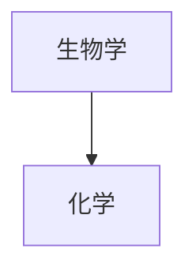

# 测试文章

> [!CAUTION] 注意
> 这个页面将会在第一篇正式文章发布前被删除




| Syntax      | Description | Test Text     |
| :---        |    :----:   |          ---: |
| Header      | Title       | Here's this   |
| Paragraph   | Text        | And more      |

>[!tip] 自定义标题
>就像这样哈哈哈哈


`反引号`中的文本将被格式化为代码。


First Term
: This is the definition of the first term.

Second Term
: This is one definition of the second term.
: This is another definition of the second term.


```ts
function sum(a : number ,b: number):number {
  return a + b;
}
```


```json
{
  "firstName": "John",
  "lastName": "Smith",
  "age": 25
}
```


这是一个简单的脚注[^1]。

[^1]: 这是脚注的内容文本。
[^2]: 在每一行的开头添加2个空格，
  可以编写跨越多行的脚注。
[^注释]: 可以使用非数字来命名脚注。但渲染时，脚注仍然会显示为数字。这样可以更容易地识别脚注内容。


